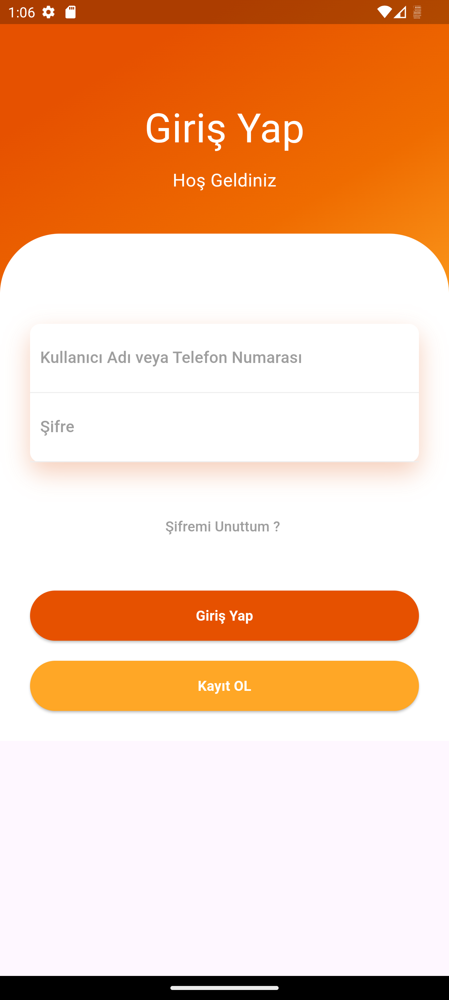
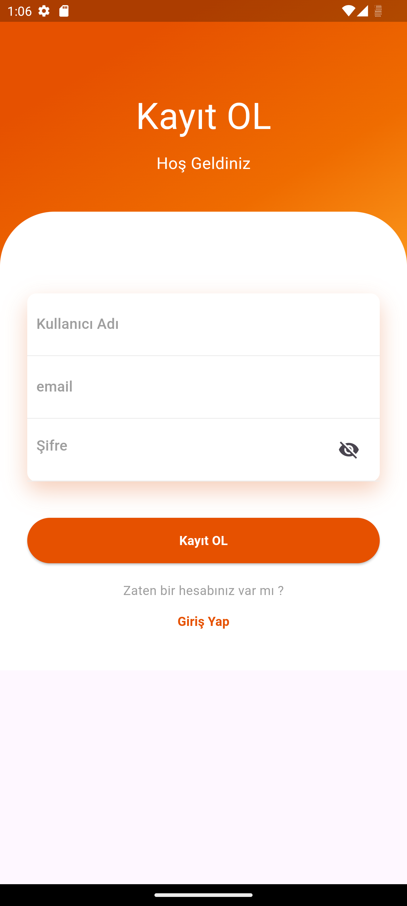
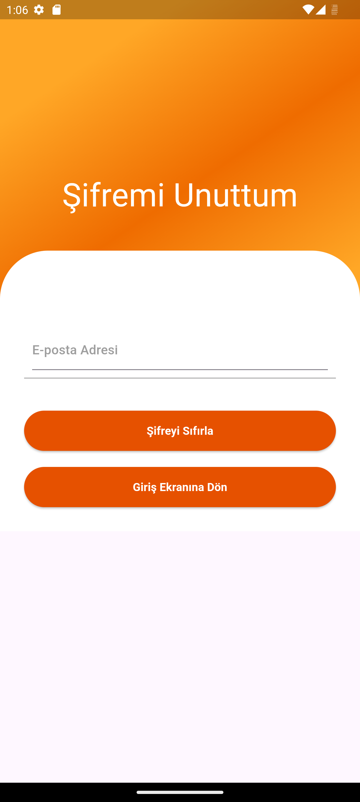
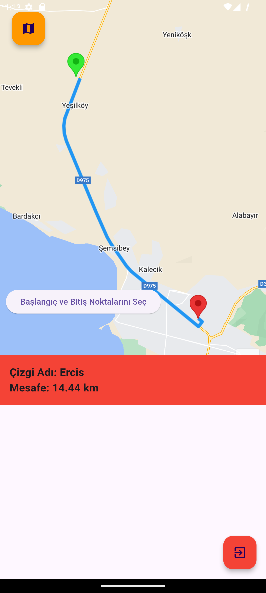

# Harita'da iki nokta arası çizgi çizme uygulaması
Bu proje Giriş yap, kayıt ol, şifremi unuttum ve harita olmak üzere 4 sayfa dan oluşur veritabanı olarak Firebase kullanılmıştır
> ⚠️ **Uyarı: Projenin çalışabilmesi için google cloud console üzerinden android api key almanız ve bu api keyi android/app/main/AndroidManifest.xml  ve feature/screens/home/home_pake.dart üzerinden api_key yazan yerlere girmeniz gerekmektedir**
>
### 1. Giriş Ekranı

Bu ekran, uygulamanın giriş ekranıdır ve kullanıcıların giriş yapmasını sağlar.

### 2. Kayıt Ol Ekranı

Bu ekran, uygulamanın Kayıt Ol ekranıdır ve kullanıcıların Kayıt olmasını sağlar.

### 3. Şifremi Unuttum Ekranı

Bu ekran, uygulamanın Şifremi Unuttum ekranıdır, şifre yenilenmesini sağlar.

### 4. Harita Ekranı

Bu ekran, uygulamanın Asıl kısmı ve haritanın bulunduğu ekrandır.
